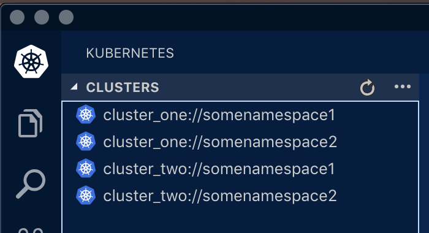

# k8s-context
Use this to rapidly configure kubernetes contexts using combinations of predfined namespaces and clusters.
The end result will be a generated kube config file under `~/.kube/config` based on the namespaces and clusters supplied.

## Why?
I found myself having to remember which namespace I wanted to deploy Kubernetes resources to so I thought why not create contexts that hard code the namespace.    

Now with the generated kube config you can switch contexts and make sure you deploy to the right namespaces.

## VSCode Example
I'm a big fan of VSCode so here's what the end result looks like in that using the [Kubernetes Extension](https://marketplace.visualstudio.com/items?itemName=ms-kubernetes-tools.vscode-kubernetes-tools).


To use the contexts with VSCode you'll need
1) [VSCode](https://code.visualstudio.com/download)
2) [Kubernetes Extension](https://marketplace.visualstudio.com/items?itemName=ms-kubernetes-tools.vscode-kubernetes-tools)

The extension will install [kubectl](https://kubernetes.io/docs/tasks/tools/install-kubectl) and [Helm Client](https://github.com/helm/helm/releases) for you if it can't find them.

## Requirements
We need to several files to be able to configure the Kubernetes contexts.
1) JSON Config
2) JSON Auth-Cluster Mapping
3) GPG encrypted tokens (single file per cluster)


## Getting Started

1) Save/hack together your config.json (Example below)
2) Hack together your maps.json (Example below)
3) Run the docker command below to generate a new `~/.kube/config` file in your home directory

> Important Note! This will backup your existing config and create a new one. It will not merge the two (To-do list!).    

You must substitute your own paths leaving the container paths the same.
```
docker run --rm \
        -v /Users/rhysevans/.kube:/root/.kube \
        -v /Users/rhysevans/config.json:/root/config.json:ro \
        -v /Users/rhysevans/maps.json:/root/maps.json:ro \
        rhysjtevans/k8s-context:latest
```
### Example of maps.json
The JSON keys must match and must exist for each cluster in the JSON config payload.
```
{
  "cluster_one": {
    "Server": "https://api.cluster1.local",
    "Token": "<TOKEN/GUID>"
  },
  "cluster_two": {
    "Server": "https://api.cluster2.local",
    "Token": "<TOKEN/GUID>"
  }
}
```

### Example of config.json 
```
{
  "kubernetes": {
    "cluster_one": [
      {
        "groups": {
          "managed": [
            "somenamespace1-somegroup1",
            "somenamespace2-somegroup2"
          ],
          "non-managed": [
              "somenamespace3-somegroup3"
          ]
        },
        "token-ending": "xxxxxx",
        "username": "userid"
      }
    ],
    "cluster_two": [
      {
        "groups": {
          "managed": [
            "somenamespace1-somegroup1",
            "somenamespace2-somegroup2"
          ],
          "non-managed": [
              "somenamespace3-somegroup3"
          ]
        },
        "token-ending": "xxxxxx",
        "username": "userid"
      }
    ]
  }
}
```
